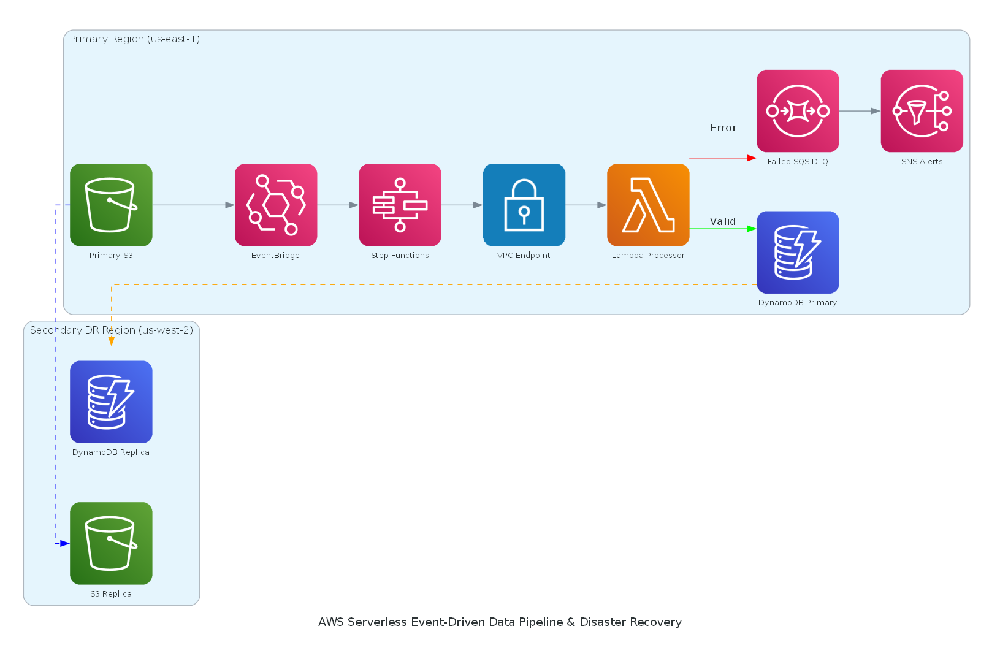

# ⚡ AWS Serverless Event-Driven Data Pipeline & Automated Disaster Recovery Engine

> A production-grade, fault-tolerant enterprise serverless data processing architecture built on AWS. Features real-time automated data validation, state machine orchestration via Step Functions, SQS Dead Letter Queuing (DLQ), automated SNS alerting, zero-public-internet VPC Endpoint security, and multi-region automated Disaster Recovery (DR) via S3 Cross-Region Replication (CRR) and DynamoDB Global Tables.

---

## 📐 Enterprise Architecture Overview

The system processes incoming data payloads asynchronously with zero server management, complete error handling via Dead Letter Queues (DLQ), and automated failover capabilities across two distinct AWS regions.

---

## 🔥 Key Technical Highlights & Best Practices

* **Zero-Server Event-Driven Core:** Fully decoupled architecture driven by **Amazon EventBridge** and **AWS Step Functions**, eliminating polling overhead and reducing idle compute costs to absolute zero.
* **VPC Endpoint Security (AWS PrivateLink):** Lambda compute functions run inside an isolated private network, accessing Amazon S3 and DynamoDB strictly via **Gateway & Interface VPC Endpoints** without traversing the public internet.
* **Automated Multi-Region Disaster Recovery:** Ensures Business Continuity (RPO ~ 0) using **S3 Cross-Region Replication (CRR)** and **DynamoDB Global Tables** spanning `us-east-1` and `us-west-2`.
* **Resilient Error Handling & Observability:** Implements state machine choice routes, exponential retries, **SQS Dead Letter Queues (DLQ)** for unprocessable records, and distributed logging/alerts via **Amazon SNS** and **Amazon CloudWatch**.

---

## 📂 Repository Structure

~~~text
aws-serverless-event-driven-pipeline/
├── architecture/
│   └── architecture-diagram.png  # Programmatically generated system architecture diagram
├── src/
│   ├── lambda_processor.py       # Core Python data validation & transformation logic
│   └── step_function_def.json    # AWS Step Functions State Machine JSON definition
├── sample_data/
│   ├── valid_payload.json        # Valid test record payload
│   └── invalid_payload.json      # Malformed/Negative test payload triggering SQS DLQ & SNS
├── generate_diagram.py           # Python script to generate the architecture diagram
├── .gitignore                    # Git ignore file for temp files and credentials
├── LICENSE                       # MIT License
└── README.md                     # Full architecture overview and deployment guide
~~~

---

## 📜 Lambda Data Processor (`src/lambda_processor.py`)

~~~python
import json
import os
import boto3
import logging

logging.basicConfig(level=logging.INFO)
logger = logging.getLogger()

dynamodb = boto3.resource('dynamodb')
TABLE_NAME = os.environ.get('DYNAMODB_TABLE', 'AuditTrailGlobal')
table = dynamodb.Table(TABLE_NAME)

def lambda_handler(event, context):
    """
    Validates incoming payload from EventBridge/Step Functions and writes to DynamoDB Global Table.
    """
    logger.info(f"Processing Event: {json.dumps(event)}")
    try:
        # Extract payload parameters
        payload = event.get('detail', event)
        record_id = payload.get('record_id')
        status = payload.get('status')
        amount = payload.get('amount')
        
        # Data Integrity Validation Rules
        if not record_id or amount is None or amount < 0:
            raise ValueError(f"Invalid record schema or negative amount detected: {payload}")
            
        # Write to DynamoDB Global Table
        table.put_item(
            Item={
                'RecordID': str(record_id),
                'Status': str(status),
                'Amount': str(amount),
                'ProcessedRegion': os.environ.get('AWS_REGION', 'us-east-1')
            }
        )
        logger.info(f"[✔] SUCCESS: RecordID {record_id} successfully processed and stored.")
        return {'statusCode': 200, 'body': json.dumps({'message': 'Success', 'record_id': record_id})}

    except Exception as e:
        logger.error(f"[❌] ERROR: Pipeline processing failed - {str(e)}")
        raise e
~~~

---

## ⚙️ Step Functions State Machine (`src/step_function_def.json`)

~~~json
{
  "Comment": "Distributed State Machine for Payload Processing and DLQ Error Handling",
  "StartAt": "ProcessDataPayload",
  "States": {
    "ProcessDataPayload": {
      "Type": "Task",
      "Resource": "arn:aws:states:::lambda:invoke",
      "Parameters": {
        "FunctionName": "arn:aws:lambda:us-east-1:303040219804:function:ServerlessDataProcessorLambda",
        "Payload.$": "$"
      },
      "Retry": [
        {
          "ErrorEquals": [
            "States.ALL"
          ],
          "IntervalSeconds": 2,
          "MaxAttempts": 3,
          "BackoffRate": 2
        }
      ],
      "Catch": [
        {
          "ErrorEquals": [
            "States.ALL"
          ],
          "Next": "SendToDeadLetterQueue"
        }
      ],
      "End": true
    },
    "SendToDeadLetterQueue": {
      "Type": "Task",
      "Resource": "arn:aws:states:::sqs:sendMessage",
      "Parameters": {
        "QueueUrl": "https://sqs.us-east-1.amazonaws.com/303040219804/FailedRecordsDLQ",
        "MessageBody.$": "$"
      },
      "Next": "NotifyOpsTeam"
    },
    "NotifyOpsTeam": {
      "Type": "Task",
      "Resource": "arn:aws:states:::sns:publish",
      "Parameters": {
        "TopicArn": "arn:aws:sns:us-east-1:303040219804:CriticalPipelineAlerts",
        "Subject": "ALERT: Serverless Pipeline Failure Detected",
        "Message.$": "$"
      },
      "End": true
    }
  }
}
~~~

---

## 🧪 End-to-End Testing & Disaster Recovery Verification

| Test Scenario | Trigger Action | Expected Pipeline Behavior |
| :--- | :--- | :--- |
| **1. Valid Ingestion & Global Replication** | Upload `valid_payload.json` (with valid positive amount) to primary S3 bucket in `us-east-1`. | EventBridge invokes Step Functions state machine ➡️ Lambda validates and writes record to DynamoDB in `us-east-1` ➡️ Object automatically replicates to S3 in `us-west-2` ➡️ DynamoDB active-active Global Table syncs item to `us-west-2`. |
| **2. Error Handling & Dead Letter Queue (DLQ)** | Upload `invalid_payload.json` (e.g., negative amount) to primary S3 bucket. | Lambda throws `ValueError` ➡️ Step Functions executes exponential backoff retry (3 attempts) ➡️ Failure caught by state machine ➡️ Payload routed to SQS Queue `FailedRecordsDLQ` ➡️ SNS dispatches critical alert email to operator. |

---

## 👤 Author & Contact Information
**Mohammed Mostafa Elsaeed**  
*Computer Engineering Student | Cloud Infrastructure & DevOps Enthusiast*  
Email: [mohammed.mostafa.elsaeed@gmail.com](mailto:mohammed.mostafa.elsaeed@gmail.com) •
[LinkedIn](https://www.linkedin.com/in/mohammed-mostafa-elsaeed/) • [GitHub](https://github.com/MOHAMMED-MOSTAFA-ELSAEED)
